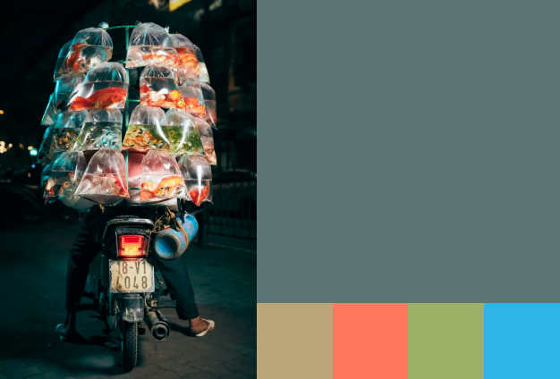
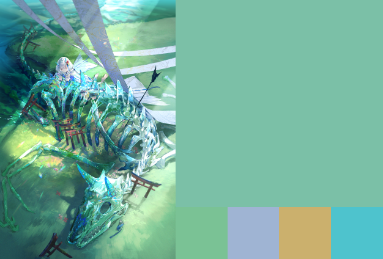

# YAP：又一个配色生成器

# 功能简介

提取图片主题色的魔法，相对于其他的算法，取色结果有更大的色相差异。

## 示例

所选颜色亮度经过自动的调节





# 原理介绍

## 色彩空间

算法采用的是LCH色彩空间，一种更好的HSV

> 为什么不是HCT？因为在我做的时候，python还没有相关的色彩空间转换的轮子。[coloria](https://github.com/coloria-dev/coloria)这样能做的今年才出现。
>
> 为什么不是CAM16,因为真的看不懂QAQ
>
> 为什么不是LAB？因为AB不够直观。
>
> 为什么不是HSL,因为HSL不够准确。

cam16 lab色彩空间

## 挖掘算法

愿你建模半生，归来仍是K聚类。

# 如何部署

参考环境：Python3.12和ArchLinux

Requirements.txt（依赖表）是通过这个命令生成的

```shell
# 无版本号
pip freeze | awk -F '==' '{print $1}' > requirements.txt
# 有版本号
pip freeze >  requirementsWithVersion.txt
```

通过这个安装依赖

```shell
pip install -r requirements. txt
```

# 咕咕计划

- [ ] 加个GUI（图形用户界面）
- [ ] 代码注释整理
- [ ] 和DCC软件集成

# 参考链接

https://material.io/blog/science-of-color-design

http://chenhui.li/documents/TVCG2022_ColorPipette.pdf
